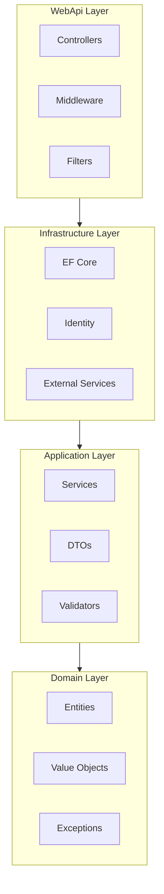
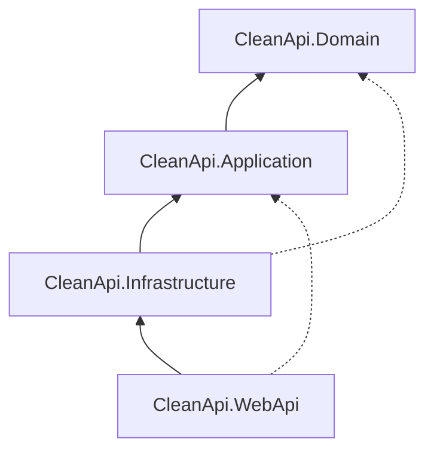
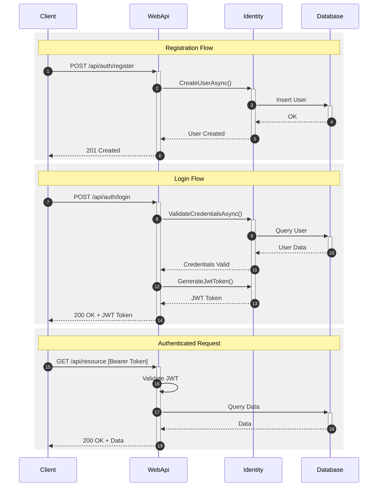
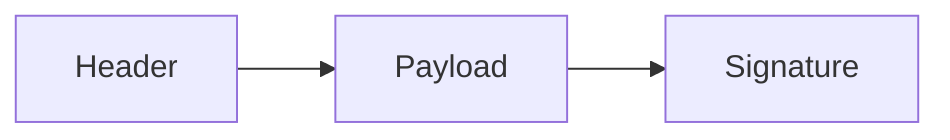
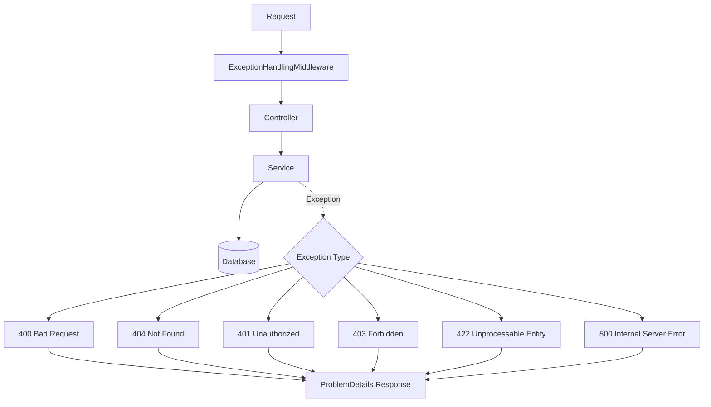
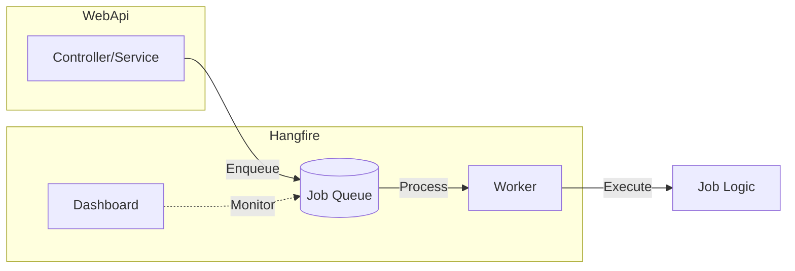
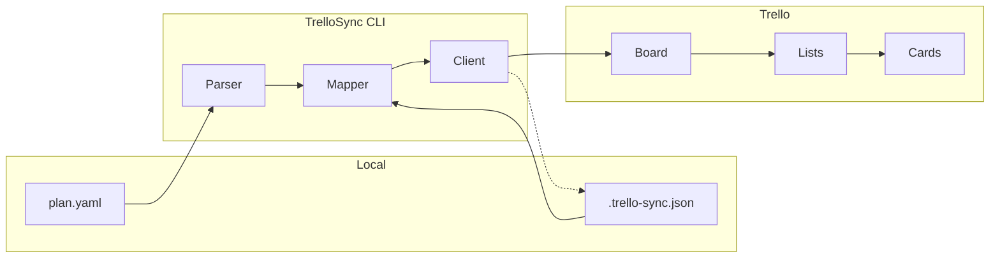

# CleanApi - Documento Architetturale

> Versione: 1.0
> Data: 2026-01-30
> Stato: In definizione

Questo documento descrive le scelte architetturali della solution **CleanApi**, un boilerplate per API REST basato su Clean Architecture in .NET.

---

## Summary

| Categoria | Scelta |
|-----------|--------|
| Framework | .NET 9 |
| Database | SQL Server |
| ORM | Entity Framework Core |
| Auth | ASP.NET Core Identity + JWT |
| Validation | FluentValidation |
| Mapping | Mapster |
| Logging | Serilog (Console) |
| Caching | In-memory |
| Background Jobs | Hangfire |
| API Docs | Swagger/OpenAPI |
| Containerization | Docker + docker-compose |
| Error Format | ProblemDetails (RFC 7807) |
| Soft Delete | Yes |
| Audit Trail | Yes |
| Task Management | TrelloSync (YAML → Trello) |
| Repository Pattern | No |
| CQRS | No |
| MediatR | No |
| Domain Events | No |
| API Versioning | No |
| Health Checks | No |
| Multi-tenancy | No |

---

## 1. Panoramica

| Attributo | Valore |
|-----------|--------|
| Nome Solution | CleanApi |
| Tipo | Backend API REST |
| Framework | .NET 9 |
| Architettura | Clean Architecture (4 layer) |
| Database | SQL Server |
| ORM | Entity Framework Core |

---

## 2. Stack Tecnologico

### 2.1 Core

| Tecnologia | Versione | Licenza | Scopo |
|------------|----------|---------|-------|
| .NET | 9 | MIT | Runtime e SDK |
| ASP.NET Core | 9 | MIT | Web framework |
| Entity Framework Core | 9.x | MIT | ORM |
| SQL Server | 2022+ | Commercial | Database relazionale |

### 2.2 Librerie Applicative

| Libreria | Licenza | Scopo |
|----------|---------|-------|
| FluentValidation | Apache 2.0 | Validazione input |
| Mapster | MIT | Object mapping |
| Serilog | Apache 2.0 | Logging strutturato |
| Hangfire | LGPL v3 | Background jobs |
| Swashbuckle | MIT | OpenAPI/Swagger |

### 2.3 Identity & Security

| Tecnologia | Scopo |
|------------|-------|
| ASP.NET Core Identity | Gestione utenti, ruoli, password |
| JWT Bearer | Autenticazione token-based per API |

### 2.4 Testing

| Libreria | Scopo |
|----------|-------|
| xUnit | Test framework |

### 2.5 DevOps

| Tecnologia | Scopo |
|------------|-------|
| Docker | Containerizzazione |
| docker-compose | Orchestrazione locale |

---

## 3. Architettura

### 3.1 Principi

La solution segue i principi della **Clean Architecture**:

- **Dependency Inversion**: Le dipendenze puntano verso l'interno (Domain)
- **Separation of Concerns**: Ogni layer ha responsabilità specifiche
- **Indipendenza dal Framework**: Il Domain non dipende da framework esterni
- **Testabilità**: La business logic è isolata e testabile

### 3.2 Layer Structure



### 3.3 Dipendenze tra Progetti



> **Legenda**: Linea continua = dipendenza diretta | Linea tratteggiata = dipendenza transitiva

### 3.4 Responsabilità dei Layer

#### Domain
- Entità di dominio e loro comportamenti
- Value Objects
- Eccezioni di dominio
- Interfacce base (`ISoftDelete`, `IAuditable`)
- **Nessuna dipendenza** da altri layer o librerie esterne

#### Application
- Logica applicativa (services)
- DTOs per input/output
- Validatori (FluentValidation)
- Interfacce per servizi infrastrutturali (`IApplicationDbContext`)
- Mapping configurations (Mapster)
- **Non contiene**: accesso diretto al database, framework-specific code

#### Infrastructure
- Implementazione `ApplicationDbContext` (EF Core)
- Entity configurations
- Interceptors (Audit, Soft Delete)
- ASP.NET Core Identity setup
- JWT token service
- Caching service
- Hangfire configuration
- Migrations

#### WebApi
- Controllers REST
- Middleware (Exception handling)
- Filters
- Swagger configuration
- Dependency Injection setup
- `Program.cs` e configurazione app

---

## 4. Decisioni Architetturali

### 4.1 Pattern NON Utilizzati

| Pattern | Decisione | Motivazione |
|---------|-----------|-------------|
| Repository Pattern | ❌ No | Manteniamo l'architettura snella; DbContext usato direttamente in Application layer |
| CQRS | ❌ No | Complessità non necessaria per questo boilerplate |
| MediatR | ❌ No | Conseguenza di no-CQRS; services chiamati direttamente |
| Domain Events | ❌ No | Keep it simple; comunicazione diretta tra services |
| Unit of Work esplicito | ❌ No | Gestito implicitamente da EF Core |

### 4.2 Pattern Utilizzati

| Pattern | Implementazione |
|---------|-----------------|
| Dependency Injection | Built-in ASP.NET Core DI |
| Result Pattern | Per gestione errori applicativi senza eccezioni |
| Soft Delete | Filtro globale EF Core + interface `ISoftDelete` |
| Audit Trail | Interceptor EF Core + interface `IAuditable` |

### 4.3 Autenticazione & Autorizzazione



#### Componenti Auth

| Componente | Responsabilità |
|------------|----------------|
| **AuthController** | Endpoints pubblici (register, login, refresh) |
| **JwtService** | Generazione e validazione token JWT |
| **IdentityService** | Wrapper su ASP.NET Core Identity |
| **[Authorize]** | Attributo per proteggere endpoints |

#### JWT Token Structure



| Sezione | Contenuto |
|---------|-----------|
| Header | `alg: HS256, typ: JWT` |
| Payload | `userId, email, roles, exp, iat` |
| Signature | `HMACSHA256(header + payload, secret)` |

### 4.4 Validazione

- **Dove**: Application layer
- **Come**: FluentValidation con validators per ogni DTO di input
- **Pipeline**: Validazione eseguita prima della business logic
- **Errori**: Restituiti come ProblemDetails (400 Bad Request)

### 4.5 Error Handling

Tutte le eccezioni sono gestite centralmente e convertite in **ProblemDetails (RFC 7807)**:



#### Mapping Eccezioni

| Eccezione | HTTP Status | Tipo |
|-----------|-------------|------|
| ValidationException | 400 | Bad Request |
| NotFoundException | 404 | Not Found |
| UnauthorizedAccessException | 401 | Unauthorized |
| ForbiddenException | 403 | Forbidden |
| DomainException | 422 | Unprocessable Entity |
| Exception (generica) | 500 | Internal Server Error |

#### Formato Risposta Errore

```json
{
  "type": "https://tools.ietf.org/html/rfc7807",
  "title": "Bad Request",
  "status": 400,
  "detail": "Validation failed",
  "errors": {
    "Email": ["Email is required"]
  }
}
```

### 4.6 Logging

| Configurazione | Valore |
|----------------|--------|
| Libreria | Serilog |
| Sink | Console only |
| Formato | Structured logging (JSON-friendly) |
| Livelli | Information (default), Warning, Error |

Motivazione: Output su Console per compatibilità con container/Docker logging drivers.

### 4.7 Caching

| Configurazione | Valore |
|----------------|--------|
| Tipo | In-memory (`IMemoryCache`) |
| Scope | Single instance |
| Use case | Dati frequentemente letti, poco modificati |

### 4.8 Background Jobs



| Configurazione | Valore |
|----------------|--------|
| Libreria | Hangfire |
| Storage | SQL Server (stesso DB applicativo) |
| Dashboard | Abilitata, protetta da autenticazione |

#### Tipi di Job

| Tipo | Metodo | Use Case |
|------|--------|----------|
| Fire-and-forget | `BackgroundJob.Enqueue()` | Email, notifiche |
| Delayed | `BackgroundJob.Schedule()` | Azioni posticipate |
| Recurring | `RecurringJob.AddOrUpdate()` | Sync, cleanup, report |
| Continuations | `BackgroundJob.ContinueWith()` | Workflow multi-step |

---

## 5. Struttura Progetti

```
CleanApi/
├── src/
│   ├── CleanApi.Domain/
│   │   ├── Common/
│   │   │   ├── BaseEntity.cs
│   │   │   ├── ISoftDelete.cs
│   │   │   └── IAuditable.cs
│   │   ├── Entities/
│   │   └── Exceptions/
│   │       ├── DomainException.cs
│   │       └── NotFoundException.cs
│   │
│   ├── CleanApi.Application/
│   │   ├── Common/
│   │   │   ├── Interfaces/
│   │   │   │   └── IApplicationDbContext.cs
│   │   │   ├── Mappings/
│   │   │   │   └── MappingConfig.cs
│   │   │   ├── Models/
│   │   │   │   └── Result.cs
│   │   │   └── Behaviors/
│   │   │       └── ValidationBehavior.cs
│   │   ├── Features/
│   │   │   └── [Feature]/
│   │   │       ├── DTOs/
│   │   │       ├── Validators/
│   │   │       └── Services/
│   │   └── DependencyInjection.cs
│   │
│   ├── CleanApi.Infrastructure/
│   │   ├── Data/
│   │   │   ├── ApplicationDbContext.cs
│   │   │   ├── Configurations/
│   │   │   ├── Interceptors/
│   │   │   │   ├── AuditableInterceptor.cs
│   │   │   │   └── SoftDeleteInterceptor.cs
│   │   │   └── Migrations/
│   │   ├── Identity/
│   │   │   ├── IdentityService.cs
│   │   │   └── JwtService.cs
│   │   ├── Services/
│   │   │   └── CacheService.cs
│   │   └── DependencyInjection.cs
│   │
│   └── CleanApi.WebApi/
│       ├── Controllers/
│       │   └── AuthController.cs
│       ├── Middleware/
│       │   └── ExceptionHandlingMiddleware.cs
│       ├── Program.cs
│       ├── appsettings.json
│       ├── appsettings.Development.json
│       └── Dockerfile
│
├── tools/
│   └── TrelloSync/
│       ├── TrelloSync.csproj
│       ├── Program.cs
│       ├── Commands/
│       ├── Models/
│       ├── Services/
│       └── Configuration/
│
├── tasks/
│   ├── plan.yaml
│   └── .trello-sync.json
│
├── tests/
│   └── CleanApi.UnitTests/
│       └── Application/
│
├── docker-compose.yml
├── .dockerignore
├── .gitignore
├── CleanApi.sln
├── ARCHITECTURE.md
├── CLAUDE.md
└── README.md
```

---

## 6. Convenzioni

### 6.1 Naming

| Elemento | Convenzione | Esempio |
|----------|-------------|---------|
| Entità | PascalCase, singolare | `User`, `Order` |
| DTO | PascalCase + suffisso | `UserDto`, `CreateUserRequest` |
| Service | PascalCase + Service | `UserService`, `IUserService` |
| Validator | DTO name + Validator | `CreateUserRequestValidator` |
| Controller | PascalCase + Controller | `UsersController` |

### 6.2 Organizzazione Features

Ogni feature in Application layer segue questa struttura:
```
Features/
└── Users/
    ├── DTOs/
    │   ├── UserDto.cs
    │   ├── CreateUserRequest.cs
    │   └── UpdateUserRequest.cs
    ├── Validators/
    │   ├── CreateUserRequestValidator.cs
    │   └── UpdateUserRequestValidator.cs
    └── Services/
        ├── IUserService.cs
        └── UserService.cs
```

### 6.3 API Endpoints

| Metodo | Pattern | Azione |
|--------|---------|--------|
| GET | `/api/[resource]` | Lista risorse |
| GET | `/api/[resource]/{id}` | Singola risorsa |
| POST | `/api/[resource]` | Crea risorsa |
| PUT | `/api/[resource]/{id}` | Aggiorna risorsa (full) |
| PATCH | `/api/[resource]/{id}` | Aggiorna risorsa (partial) |
| DELETE | `/api/[resource]/{id}` | Elimina risorsa (soft delete) |

---

## 7. Configurazione

### 7.1 appsettings.json Structure

```json
{
  "ConnectionStrings": {
    "DefaultConnection": "Server=...;Database=CleanApi;..."
  },
  "JwtSettings": {
    "Secret": "...",
    "Issuer": "CleanApi",
    "Audience": "CleanApi",
    "ExpirationInMinutes": 60
  },
  "Hangfire": {
    "Dashboard": {
      "Enabled": true
    }
  }
}
```

### 7.2 Variabili d'Ambiente (Docker)

| Variabile | Descrizione |
|-----------|-------------|
| `ConnectionStrings__DefaultConnection` | Connection string SQL Server |
| `JwtSettings__Secret` | Secret per firma JWT |
| `ASPNETCORE_ENVIRONMENT` | Development / Production |

---

## 8. TrelloSync Tool

Tool CLI interno per sincronizzazione task di sviluppo con Trello.

### 8.1 Summary

| Aspetto | Scelta |
|---------|--------|
| Direzione | One-way (Plan → Trello) |
| Board Structure | Liste per Status |
| Task Source | YAML dedicato |
| Granularità | Media (card + checklist) |
| Scope | Interno a CleanApi |
| Automazione | CLI manuale |
| State Mapping | File .trello-sync.json |

### 8.2 Architettura



### 8.3 Board Structure

```
[Backlog] → [To Do] → [In Progress] → [Done]
```

- Cards si spostano tra liste in base allo status
- Labels indicano la fase (Phase 1, Phase 2, etc.)
- Checklist per subtask

### 8.4 CLI Commands

| Comando | Descrizione |
|---------|-------------|
| `trello-sync init` | Crea board e liste su Trello |
| `trello-sync push` | Sincronizza task da YAML a Trello |
| `trello-sync status` | Mostra diff tra locale e Trello |
| `trello-sync pull-status` | Aggiorna status locale da posizione card |

### 8.5 Task Schema (YAML)

```yaml
project: CleanApi
version: "1.0"

phases:
  - id: phase-1
    name: "Phase 1: Solution Structure"
    tasks:
      - id: task-1-1
        title: "Setup solution and projects"
        description: "Create solution with all project references"
        status: backlog
        labels:
          - setup
        subtasks:
          - Create CleanApi.sln
          - Create Domain project
          - Create Application project
          - Create Infrastructure project
          - Create WebApi project
          - Configure references
```

### 8.6 Status Mapping

| YAML Status | Trello List |
|-------------|-------------|
| `backlog` | Backlog |
| `todo` | To Do |
| `in_progress` | In Progress |
| `done` | Done |

### 8.7 Sync State File

`.trello-sync.json` traccia il mapping tra ID locali e Trello:

```json
{
  "boardId": "abc123",
  "lists": {
    "backlog": "list-id-1",
    "todo": "list-id-2",
    "in_progress": "list-id-3",
    "done": "list-id-4"
  },
  "cards": {
    "task-1-1": "card-id-xxx",
    "task-1-2": "card-id-yyy"
  },
  "labels": {
    "phase-1": "label-id-1",
    "setup": "label-id-2"
  },
  "lastSync": "2026-01-30T10:00:00Z"
}
```

### 8.8 Configuration

Credenziali Trello via environment variables:

| Variabile | Descrizione |
|-----------|-------------|
| `TRELLO_API_KEY` | API Key da trello.com/app-key |
| `TRELLO_TOKEN` | Token generato con API Key |
| `TRELLO_BOARD_NAME` | Nome board (default: nome progetto) |

### 8.9 Project Structure

```
tools/
└── TrelloSync/
    ├── TrelloSync.csproj
    ├── Program.cs
    ├── Commands/
    │   ├── InitCommand.cs
    │   ├── PushCommand.cs
    │   ├── StatusCommand.cs
    │   └── PullStatusCommand.cs
    ├── Models/
    │   ├── TaskPlan.cs
    │   ├── Phase.cs
    │   ├── TaskItem.cs
    │   └── SyncState.cs
    ├── Services/
    │   ├── YamlParser.cs
    │   ├── TrelloClient.cs
    │   └── SyncService.cs
    └── Configuration/
        └── TrelloSettings.cs

tasks/
├── plan.yaml
└── .trello-sync.json
```

---

## 9. Roadmap & Estensioni Future

Funzionalità **non incluse** nel boilerplate ma facilmente aggiungibili:

| Funzionalità | Note |
|--------------|------|
| API Versioning | Se necessario, via URL path `/api/v1/...` |
| Health Checks | Per Kubernetes readiness/liveness |
| Redis Cache | Sostituire in-memory per scenari distribuiti |
| Integration Tests | Con Testcontainers |
| Architecture Tests | Con NetArchTest |
| Multi-tenancy | Filtro globale per TenantId |
| Outbox Pattern | Per consistenza eventi/messaggi |

---

## 10. Changelog

| Versione | Data | Modifiche |
|----------|------|-----------|
| 1.4 | 2026-01-30 | Aggiunta sezione TrelloSync Tool |
| 1.3 | 2026-01-30 | Aggiunto Summary con tutte le scelte in formato minimal |
| 1.2 | 2026-01-30 | Stile diagrammi Mermaid semplificato |
| 1.1 | 2026-01-30 | Aggiunta diagrammi Mermaid |
| 1.0 | 2026-01-30 | Documento iniziale |

---

## 11. Riferimenti

- [Clean Architecture - Robert C. Martin](https://blog.cleancoder.com/uncle-bob/2012/08/13/the-clean-architecture.html)
- [ASP.NET Core Documentation](https://docs.microsoft.com/en-us/aspnet/core/)
- [Entity Framework Core](https://docs.microsoft.com/en-us/ef/core/)
- [FluentValidation](https://docs.fluentvalidation.net/)
- [Mapster](https://github.com/MapsterMapper/Mapster)
- [Serilog](https://serilog.net/)
- [Hangfire](https://www.hangfire.io/)
- [RFC 7807 - Problem Details](https://tools.ietf.org/html/rfc7807)
